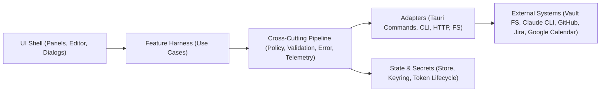

# refactor: Redesign EN:TTOKK Architecture for End-to-End and Cross-Cutting Concerns

## Enhancement Summary

**Deepened on:** 2026-02-20  
**Sections enhanced:** 10  
**Inputs used:** Local architecture scan + official docs + skill-guided review

### Key Improvements

1. OpenAI Harness Engineering 원칙을 실행 가능한 설계 규칙(슬라이스/플랫폼 경계)으로 구체화
2. 외부 연동 안정성 기준(레이트리밋/재시도/백오프/동기화 토큰 만료)을 수치/규칙으로 명시
3. Tauri v2 권한 모델(capability/permission/runtime authority)을 실제 재설계 체크리스트로 추가
4. OAuth Native App(PKCE 필수) 및 Desktop 보안 요구사항을 횡단 관심사 표준에 반영

### New Considerations Discovered

- 현재 워크스페이스에는 `docs/solutions/`가 없어 institutional learnings 자동 재사용 경로가 비어 있음
- 별도 에이전트 디렉터리(`.codex/agents`, `~/.codex/agents`)가 없어 이번 심화는 skill 기반 검토로 수행
- GitHub Search API와 Secondary rate limit을 반영하지 않으면 activity-observatory에 즉시 장애 리스크 존재

## Overview

OpenAI의 Harness Engineering 관점(종단 관심사 중심 + 횡단 관심사 플랫폼화)을 기준으로, 현재 EN:TTOKK(Tauri + React + TypeScript) 아키텍처를 재설계한다. 목표는 기능 추가 시 변경 범위를 줄이고, 보안/오류/관측성/정책을 일관되게 적용하는 것이다.

## Problem Statement

현재 구조는 기능 자체는 분리되어 있으나, 실제 실행 흐름은 상위 UI와 개별 스토어에 분산되어 있다.

- 상위 UI에서 다수 기능을 직접 오케스트레이션하고 있음: `src/App.tsx:57`, `src/layouts/EditorLayout.tsx:50`
- 각 Zustand store가 API 호출/상태/에러 정책을 개별 구현: `src/features/chat/store/chatStore.ts:56`, `src/features/google-calendar/store/googleCalendarStore.ts:134`, `src/features/jira/store/jiraStore.ts:80`
- Tauri command 등록은 평면적으로 확장되고, command 계층에 도메인/정책 로직이 함께 섞임: `src-tauri/src/lib.rs:20`, `src-tauri/src/commands/chat_ipc.rs:390`, `src-tauri/src/commands/google_calendar.rs:301`
- 내부 institutional learnings(`docs/solutions/`) 부재로 재발 방지 패턴 축적이 부족함

### Research Insights

**Best Practices:**
- 아키텍처 변경 시 기능 중심 수직 슬라이스와 횡단 플랫폼 모듈을 분리하면 장기 유지보수성이 높아짐(Harness Engineering).
- Tauri v2는 커맨드 접근을 capability/permission/runtime authority로 제한하는 것이 표준 보안 모델임.
- React는 state update 로직이 커질수록 reducer + context(또는 동등한 명시적 액션 패턴)로 흐름을 통합할 것을 권장함.

**Edge Cases:**
- 슬라이스 분리 없이 store 수만 늘리면 호출 경로는 줄지 않고 오히려 동기화 복잡도가 증가할 수 있음.
- 권한 모델을 설계하지 않은 상태에서 command를 추가하면 기능 회귀보다 보안 회귀가 먼저 발생할 가능성이 큼.

## Section Manifest

1. `Overview / Problem Statement`: 왜 지금 재설계가 필요한지와 기존 결합 구조 증거
2. `Research Summary`: 공식 문서 기반 설계 원칙과 제약조건
3. `Proposed Solution`: 종단/횡단 분리 모델과 목표 아키텍처
4. `Technical Approach`: 프런트/백엔드/계약 재구성 방법
5. `Implementation Phases`: 단계별 이관 및 품질 게이트
6. `System-Wide Impact`: 상호작용/오류/상태 리스크
7. `SpecFlow Analysis`: 사용자 흐름 및 누락 요구사항
8. `Acceptance Criteria`: 기능/비기능/품질 게이트의 측정 기준
9. `Risk & Operations`: 운영 리스크와 완화 방안
10. `References`: 내부 코드 근거 + 외부 1차 출처

## Skill & Learnings Discovery

### Skills Matched and Applied

- `architecture-strategist`
- `security-sentinel`
- `performance-oracle`
- `pattern-recognition-specialist`
- `kieran-typescript-reviewer`
- `spec-flow-analyzer`
- `framework-docs-researcher`
- `best-practices-researcher`

### Discovery Results

- Project-local skills: 없음 (`.codex/skills`)
- Global skills: 사용 가능 (`~/.codex/skills`)
- Agents directories (`.codex/agents`, `~/.codex/agents`): 없음
- Institutional learnings (`docs/solutions`, `.codex/docs`, `~/.codex/docs`): 없음

## Research Summary

### Local Research

- 스택 확인:
  - Frontend: React 19 + Zustand + TypeScript strict + Tailwind v4 (`package.json`)
  - Backend: Tauri v2 command IPC + Rust + tauri-specta (`src-tauri/src/lib.rs:17`)
- 경계 특성:
  - 프런트는 `apiClient`를 통해 command invoke + event listen (`src/lib/api-client.ts:73`)
  - 백엔드는 command별 입력 검증/외부 연동을 직접 수행 (`src-tauri/src/commands/*.rs`)
- 보안 관련 기존 강점:
  - Vault path 검증 로직 존재 (`src-tauri/src/commands/file.rs:15`)
  - Jira 토큰 keyring 저장 (`src-tauri/src/commands/secure.rs:3`)

### External Research (Official / Primary Sources)

- OpenAI Harness Engineering: 제품 개발은 종단 관심사(E2E user outcomes)와 횡단 관심사(shared concerns)를 함께 설계해야 품질과 속도가 올라감.
  - https://openai.com/index/harness-engineering/
- Harness Engineering 추가 포인트: 아키텍처 분할은 기술 레이어보다 "사용자 성과를 만드는 종단 프로세스" 중심으로 해야 효과가 큼.
  - https://openai.com/index/harness-engineering/
- Tauri Process Model: 웹뷰와 Rust core 분리, 최소 권한 기반 설계가 핵심.
  - https://v2.tauri.app/concept/process-model/
- Tauri Capabilities & Runtime Authority: 창/웹뷰/명령 권한을 capability로 명시하고 런타임 권한을 제한.
  - https://v2.tauri.app/security/capabilities/
  - https://v2.tauri.app/security/runtime-authority/
- Tauri CSP: 기본 CSP 및 개발/프로덕션 분리 관리 권장.
  - https://v2.tauri.app/security/csp/
- Tauri State Management & Calling Rust from Frontend: command는 직렬화 가능한 경계, 공유 상태는 명시적으로 관리.
  - https://v2.tauri.app/develop/state-management/
  - https://v2.tauri.app/develop/calling-rust/
- Tauri 권한 모델 핵심: permission(명령 허용/거부), scope(명령 입력 제한), capability(윈도우/웹뷰에 묶인 권한 집합)로 접근을 제어.
  - https://v2.tauri.app/security/capabilities/
- React 공식 권장: 상태 로직 복잡도 증가 시 reducer + context로 명시적 흐름 구성, 불필요한 Effect 제거.
  - https://react.dev/learn/scaling-up-with-reducer-and-context
  - https://react.dev/learn/you-might-not-need-an-effect
- Zustand slices pattern: 스토어를 도메인 슬라이스로 분리 후 합성.
  - https://raw.githubusercontent.com/pmndrs/zustand/main/docs/guides/slices-pattern.md
- Google OAuth Native App: Installed app client는 PKCE 사용이 필수.
  - https://developers.google.com/identity/protocols/oauth2/native-app
- Google Calendar incremental sync: sync token 만료 시 `410 Gone`을 처리하고 full sync로 복구해야 함.
  - https://developers.google.com/workspace/calendar/api/guides/sync
- GitHub API limits: Search API는 별도 rate limit(분당 요청 제한)과 secondary rate limits를 함께 고려해야 함.
  - https://docs.github.com/en/rest/using-the-rest-api/rate-limits-for-the-rest-api
  - https://docs.github.com/en/rest/using-the-rest-api/best-practices-for-using-the-rest-api
- Jira Cloud rate limiting: `429` 및 관련 헤더 기반 backoff/retry 전략 필요.
  - https://developer.atlassian.com/cloud/jira/platform/rate-limiting/

### Deprecation / Sunset Check (2026-02-20)

- Google Calendar API: 2026-02-20 기준 전체 API sunset 공지 없음(공식 release notes 범위 확인)
  - https://developers.google.com/workspace/calendar/release-notes
- GitHub REST API: 2022-11-28 버전 체계 도입 후 breaking changes 정책 기반으로 운영, Search API sunset 공지 없음
  - https://github.blog/changelog/2022-11-28-rest-api-versioning/
  - https://docs.github.com/en/rest/about-the-rest-api/breaking-changes
- Atlassian/Jira Cloud REST: deprecation policy 기반 사전 공지 운영(전면 sunset 공지 없음)
  - https://developer.atlassian.com/platform/marketplace/atlassian-rest-api-policy/#deprecation-policy

## Proposed Solution

### Architecture Principle

1. 종단 관심사(End-to-End): 사용자 결과 단위로 수직 슬라이스를 정의한다.
2. 횡단 관심사(Cross-Cutting): 보안/권한/검증/오류/관측성/재시도/설정은 플랫폼 계층으로 중앙화한다.
3. 경계 명시화: UI ↔ UseCase ↔ Adapter ↔ External 시스템 경계를 타입과 정책으로 고정한다.

### Target Architecture (High Level)

### End-to-End Slices

- `vault-workspace`: vault open/read/write, note 탐색/편집, daily note 생성
- `ai-conversation`: Claude 상태 확인, 스트림 채팅, 일일 요약
- `activity-observatory`: GitHub 활동 + Claude activity 집계/조회
- `planning-calendar`: Google Calendar OAuth/sync/day view
- `issue-tracking`: Jira 연결 검증/이슈 조회

### Cross-Cutting Platform Modules

- `platform/policy`: capability/permission/feature flag
- `platform/validation`: 입력 정규화, path/URL/email/token 정책
- `platform/errors`: 공통 에러 taxonomy + user-facing mapping
- `platform/telemetry`: correlation id, structured log, trace/span
- `platform/reliability`: timeout/retry/backoff/cancellation rules
- `platform/security`: secret handling, CSP/capability matrix, redaction
- `platform/config`: env/config schema validation

### Research Insights

**Best Practices:**
- 횡단 관심사는 기능팀이 중복 구현하지 않도록 "정책 파이프라인"으로 강제해야 함.
- Tauri command 노출은 필요 최소 권한(capability)으로 창 단위 제약을 두고, 허용 명령을 명시적으로 선언해야 함.
- API adapter는 rate-limit/timeout/retry/cancellation을 공통 계약으로 가져야 함.

**Implementation Details:**
- 각 슬라이스는 `use-case` 중심으로 동작하고, adapter는 부작용(IPC/HTTP/CLI/FS)만 수행하도록 역할 고정.
- 공통 에러 포맷: `code`, `message`, `retryable`, `traceId`, `source`.

**Edge Cases:**
- 권한 매트릭스 없이 개발하면 기능은 되지만 릴리즈 시 security hardening 비용이 급증.
- retry 정책이 슬라이스마다 다르면 동일 오류에서 서로 다른 UX를 보여 운영 혼란이 발생.

## Technical Approach

### Frontend Restructure

- `src/features/<slice>/`를 `ui`, `state`, `application`, `infrastructure`, `types`로 분리
- Zustand store는 slice 합성으로 분할하고, 네트워크/IPC 호출은 `infrastructure`로 이동
- 상위 레이아웃(`App`, `EditorLayout`)은 조합만 담당하고 비즈니스 오케스트레이션 제거

### Backend Restructure (Tauri)

- `commands`는 transport-only로 축소하고, 도메인 실행은 `application` 서비스로 위임
- 공유 정책(검증/오류/관측성/timeout/retry)을 command 공통 미들웨어 형태로 적용
- command 응답 envelope 통일(성공/오류 코드/추적 ID)

### Data/Contract Strategy

- `src/types/api/*`와 Rust `specta` 타입을 bounded context별로 정리
- 스트리밍(chat)과 request-response(jira/google/github)를 동일한 에러/추적 규칙으로 맞춤
- 명령어/이벤트 네이밍 컨벤션 통일 (`<slice>.<action>`)

### Research Insights

**Best Practices:**
- React 측 복잡한 상태 전이 로직은 이벤트/액션 중심으로 모아 Effect 남용을 줄여야 함.
- Zustand는 slice pattern으로 분할하되 middleware 적용 지점은 root composition에서 일관되게 유지해야 함.
- Tauri command는 transport boundary로 유지하고, 검증/권한/오류 분류는 공통 계층에서 처리해야 함.

**Performance Considerations:**
- store 분할 시 selector 단위 구독으로 불필요한 렌더를 줄여야 함.
- 패널별 lazy hydration을 적용해 앱 시작 시점의 동기 작업을 최소화.

**Implementation Details:**
- 권장 구조(예시):
  - `src/features/ai-conversation/application/`
  - `src/features/ai-conversation/infrastructure/`
  - `src-tauri/src/application/ai_conversation/`
  - `src-tauri/src/transport/commands/`

**Edge Cases:**
- stream/chat 상태를 UI와 전역 store가 동시에 소유하면 취소/재시도에서 race condition이 발생.
- OAuth/token refresh와 day-level fetch가 경합하면 stale token으로 재시도 폭증 가능.

## Implementation Phases

### Phase 1: Foundation (1~2주)

- 아키텍처 ADR 작성(슬라이스 정의, 횡단 정책 표준)
- 공통 Error/Telemetry/Validation 스펙 수립
- command envelope 및 correlation id 표준 도입

### Phase 2: Pilot Slice Migration (2주)

- `ai-conversation`, `vault-workspace` 2개 슬라이스 우선 전환
- `App.tsx`, `EditorLayout.tsx` 오케스트레이션 로직 축소
- IPC/stream error path 통합

### Phase 3: Integration Slice Migration (2~3주)

- `planning-calendar`, `issue-tracking`, `activity-observatory` 전환
- OAuth/token lifecycle, 외부 API timeout/retry 표준화

### Phase 4: Hardening (1~2주)

- 통합 테스트/관측성 대시보드/런북 정리
- 성능/보안 검증, 문서 동기화(`CLAUDE.md`, 운영 플레이북)

### Research Insights

**Best Practices:**
- 마이그레이션 단계마다 "기능 성공" + "운영 안정성" 게이트를 동시에 통과해야 다음 단계 진입.
- Hardening 단계에서 rate-limit, timeout, cancel, retry를 의도적으로 깨보는 failure injection 테스트가 필요함.

**Quality Enhancements:**
- Phase 종료 체크리스트에 보안권한(capability), 추적가능성(traceId), 복구성(retryability)을 의무 항목으로 추가.
- `src/bindings.ts` 생성/검증을 CI 체크에 포함해 프런트-백엔드 계약 드리프트를 방지.

## Alternative Approaches Considered

1. 현 구조 유지 + 코드 스타일 가이드 강화
   - 장점: 빠름
   - 단점: 횡단 정책 중복, 기능 증가 시 변경 반경 확대
2. 백엔드 대규모 분리(외부 서비스화)
   - 장점: 장기 확장성
   - 단점: 현재 데스크톱 앱 컨텍스트에서 운영 복잡도 과도

## System-Wide Impact

### Interaction Graph

- 현재: `UI` -> `Store` -> `apiClient` -> `Tauri command` -> `외부 시스템`
- 목표: `UI` -> `Feature Harness` -> `Cross-Cutting Pipeline` -> `Adapter` -> `외부 시스템`
- 예시 체인(현재):
  - Daily note 열기: `src/App.tsx:121` -> `src/features/daily-notes/store/dailyNotesStore.ts:104` -> `src/features/vault/store/vaultStore.ts:97` -> `src-tauri/src/commands/file.rs:127`
  - Chat 스트림: `src/features/chat/store/chatStore.ts:192` -> `src/lib/api-client.ts:141` -> `src-tauri/src/commands/chat_ipc.rs:434`

### Error & Failure Propagation

- 현재: feature별 error 처리 형식이 다름(문자열/상태 혼재)
- 목표: `AppError(code, message, retryable, traceId)` 공통화
- 필수 정렬 대상:
  - IPC validation error (`chat_ipc`, `file`)
  - 외부 API 오류(`jira`, `google_calendar`, `github`)
  - UX 에러 배너 표준화(`chat`, `jira`, `google-calendar`)

### State Lifecycle Risks

- 토큰/세션/동기화 상태가 store별로 분산되어 partial failure 시 불일치 가능
  - Google sync token 갱신/만료 재동기화: `src/features/google-calendar/store/googleCalendarStore.ts:221`
  - Chat stream cancel/cleanup: `src-tauri/src/commands/chat_ipc.rs:468`
- 완화: 상태 전이 다이어그램 + idempotent 재시도 + 정리(cleanup) 핸들러 표준화

### API Surface Parity

- 동일 관심사에 대한 API 표면 통일 필요:
  - status check: backend health / claude status / jira status
  - auth/token flows: jira keyring / google oauth refresh
  - activity query: github date query / claude date query

### Integration Test Scenarios

1. Vault open 실패 후 daily note 자동 생성이 안전하게 중단되는지
2. Chat stream 도중 취소 시 프로세스/리스너/상태가 누수 없이 정리되는지
3. Google sync token 만료(410) 후 full sync 재시도가 일관되게 동작하는지
4. Jira token이 keyring에서 삭제된 상태에서 재연결 UX가 정상 복구되는지
5. GitHub/Claude activity 패널 동시 갱신 시 race 없이 최신 요청만 반영되는지

### Operational Resilience Baselines

- GitHub REST primary limit(인증): 시간당 5,000 요청을 예산으로 관리
- GitHub Search API: 분당 30 요청 제한을 고려해 캐시 + 배치 + 백오프 적용
- GitHub secondary rate limits: `Retry-After`/`x-ratelimit-remaining` 기반 throttle 표준화
- Google Calendar incremental sync: `410 Gone` 수신 시 sync token 초기화 후 full sync 재시작
- Jira Cloud: `429` 수신 시 header 기반 지수 백오프 재시도

### Research Insights

**Best Practices:**
- 횡단 관심사에서 API별 레이트리밋 정책을 "어댑터별 규칙"이 아니라 "플랫폼 공통 정책"으로 캡슐화해야 함.
- 오류는 사용자 메시지와 운영 메시지를 분리해 UX 일관성과 디버깅 정확도를 동시에 확보해야 함.

**Edge Cases:**
- 여러 패널이 동시에 갱신될 때 동일 API에 burst를 발생시키면 secondary limit에 먼저 걸릴 수 있음.
- 활동 조회와 동기화가 교차될 때 stale cursor/sync token이 잔존하면 중복/누락 데이터가 발생할 수 있음.

## SpecFlow Analysis

### User Flow Overview

1. 앱 시작 -> 백엔드 헬스체크 -> vault 자동 복원/검증 -> 기본 화면 진입
2. 노트 편집 -> 저장/링크 탐색 -> 사이드패널(캘린더/채팅/연동) 연계
3. 채팅 실행 -> 상태체크 -> 스트리밍 -> 취소/오류 복구
4. 외부 연동 연결 -> 인증 -> 데이터 동기화 -> 패널 조회

### Flow Permutations Matrix

| 축 | 주요 분기 |
|---|---|
| 사용자 상태 | 최초 사용자 / 기존 vault 사용자 |
| 연동 상태 | 연결 안 됨 / 연결됨 / 토큰 만료 |
| 네트워크 | 정상 / 지연 / 타임아웃 |
| 실행 컨텍스트 | 채팅 중 / 동기화 중 / 동시 패널 사용 |

### Missing Elements & Gaps

- 공통 오류 스키마 부재
- cross-feature cancellation 정책 부재
- trace/correlation ID 표준 부재
- 횡단 정책(CSP/capability/validation) 문서화 부족
- store 간 상태 전이/소유권 경계 불명확

### Critical Questions Requiring Clarification

1. `critical`: 각 슬라이스의 최종 소유 팀/모듈 경계를 어디까지 고정할 것인가?
2. `critical`: 공통 에러 코드 체계(사용자 노출 코드 vs 내부 코드)를 어떤 규칙으로 운영할 것인가?
3. `important`: OAuth/CLI/HTTP timeout 기본값과 재시도 한도를 전역 정책으로 강제할 것인가?
4. `important`: Observability 저장 위치(파일/원격)와 개인정보 마스킹 기준은?

## Acceptance Criteria

### Functional Requirements

- [x] 5개 E2E slice 경계 및 책임이 문서와 코드 구조에 반영된다.
- [ ] 횡단 관심사 모듈(오류/검증/관측성/보안/신뢰성)이 공통 경로로 동작한다.
- [x] 상위 UI 컴포넌트는 orchestration 책임을 최소화한다.
- [x] command 계층은 transport 중심으로 축소되고 도메인 실행은 application 계층으로 이동한다.

### Non-Functional Requirements

- [x] 보안: Tauri capability/CSP 정책이 문서화 및 검증된다.
- [ ] 성능: 초기 로딩과 주요 패널 전환 성능 회귀가 없다.
- [x] 안정성: 외부 API 실패/재시도/취소 시 일관된 사용자 피드백 제공.

### Quality Gates

- [x] `bun run check` 통과
- [x] `bun run build` 통과
- [ ] 통합 테스트(위 5개 시나리오) 통과
- [x] CLAUDE.md/운영 플레이북 동기화
- [x] capability/permission 매트릭스 리뷰 완료
- [x] 에러 코드/traceId 규격 검증 완료
- [x] 외부 API limit/timeout/retry 테스트 완료

## Success Metrics

- 횡단 정책 변경 시 수정 파일 수 30% 이상 감소
- 신규 연동 기능 추가 시 구현 리드타임 20% 이상 감소
- production error에서 trace ID 기반 원인 추적 가능 비율 90% 이상
- 취소/재시도 관련 결함 건수 분기별 감소

## Dependencies & Prerequisites

- 리팩터링 기간 동안 브랜치 전략(`codex/*`) 및 단계별 병합 규칙 합의
- specta 타입 갱신 프로세스 정착 (`src/bindings.ts` 자동 생성 준수)
- 테스트 환경에서 `claude`, `gh`, OAuth callback 포트(31337) 재현 가능 조건 확보

## Risk Analysis & Mitigation

- 리스크: 대규모 구조 전환으로 일시적 개발 속도 저하
  - 대응: Phase별 pilot + 점진 이관 + feature flag
- 리스크: 외부 연동 회귀
  - 대응: 연동별 contract test + mock/fake adapter 도입
- 리스크: 관측성 도입 시 개인정보 노출
  - 대응: redaction 규칙 기본 적용 + 로그 샘플링

## Resource Requirements

- 1명(프런트) + 1명(백엔드/Tauri) + 1명(테스트/운영 검증) 최소 2~3주 집중
- 운영 검증용 시나리오 문서/체크리스트 준비

## Future Considerations

- Claude/GitHub/Jira/Google 외 신규 연동을 동일 adapter contract로 확장
- 장기적으로 agent-native workflow(자동 요약/자동 triage)를 슬라이스 단위로 추가

## Documentation Plan

- `CLAUDE.md`: 아키텍처 섹션(슬라이스/횡단 정책/테스트 게이트) 업데이트
- `docs/plans/`: phase별 실행 계획과 결정 기록(ADR 링크)
- 운영 문서: 통합 플레이북에 오류 코드/복구 플로우 반영

## References & Research

### Internal References

- `src/App.tsx:57`
- `src/layouts/EditorLayout.tsx:50`
- `src/lib/api-client.ts:73`
- `src/features/chat/store/chatStore.ts:56`
- `src/features/google-calendar/store/googleCalendarStore.ts:134`
- `src/features/jira/store/jiraStore.ts:80`
- `src/features/daily-notes/store/dailyNotesStore.ts:104`
- `src/features/vault/store/vaultStore.ts:69`
- `src-tauri/src/lib.rs:20`
- `src-tauri/src/commands/file.rs:15`
- `src-tauri/src/commands/chat_ipc.rs:390`
- `src-tauri/src/commands/google_calendar.rs:301`
- `src-tauri/src/commands/jira.rs:163`
- `src-tauri/src/commands/secure.rs:3`
- `src/features/claude-activity/store/claudeActivityStore.ts:65`
- `src/features/google-calendar/store/googleCalendarHelpers.ts:110`

### External References

- OpenAI Harness Engineering: https://openai.com/index/harness-engineering/
- Tauri Process Model: https://v2.tauri.app/concept/process-model/
- Tauri Calling Rust: https://v2.tauri.app/develop/calling-rust/
- Tauri State Management: https://v2.tauri.app/develop/state-management/
- Tauri Capabilities: https://v2.tauri.app/security/capabilities/
- Tauri Runtime Authority: https://v2.tauri.app/security/runtime-authority/
- Tauri CSP: https://v2.tauri.app/security/csp/
- React Reducer + Context: https://react.dev/learn/scaling-up-with-reducer-and-context
- React You Might Not Need an Effect: https://react.dev/learn/you-might-not-need-an-effect
- Zustand Slices Pattern: https://raw.githubusercontent.com/pmndrs/zustand/main/docs/guides/slices-pattern.md
- Google OAuth for Native Apps (PKCE): https://developers.google.com/identity/protocols/oauth2/native-app
- Google Calendar Incremental Sync: https://developers.google.com/workspace/calendar/api/guides/sync
- Google Calendar Release Notes: https://developers.google.com/workspace/calendar/release-notes
- GitHub REST Rate Limits: https://docs.github.com/en/rest/using-the-rest-api/rate-limits-for-the-rest-api
- GitHub REST Best Practices (Secondary Limits): https://docs.github.com/en/rest/using-the-rest-api/best-practices-for-using-the-rest-api
- GitHub REST API Versioning Changelog (2022-11-28): https://github.blog/changelog/2022-11-28-rest-api-versioning/
- GitHub REST Breaking Changes: https://docs.github.com/en/rest/about-the-rest-api/breaking-changes
- Atlassian Deprecation Policy: https://developer.atlassian.com/platform/marketplace/atlassian-rest-api-policy/#deprecation-policy
- Atlassian Jira Cloud Rate Limiting: https://developer.atlassian.com/cloud/jira/platform/rate-limiting/

### Related Work

- Existing plan: `docs/plans/2026-02-20-feat-project-claude-md-operating-guide-plan.md`
